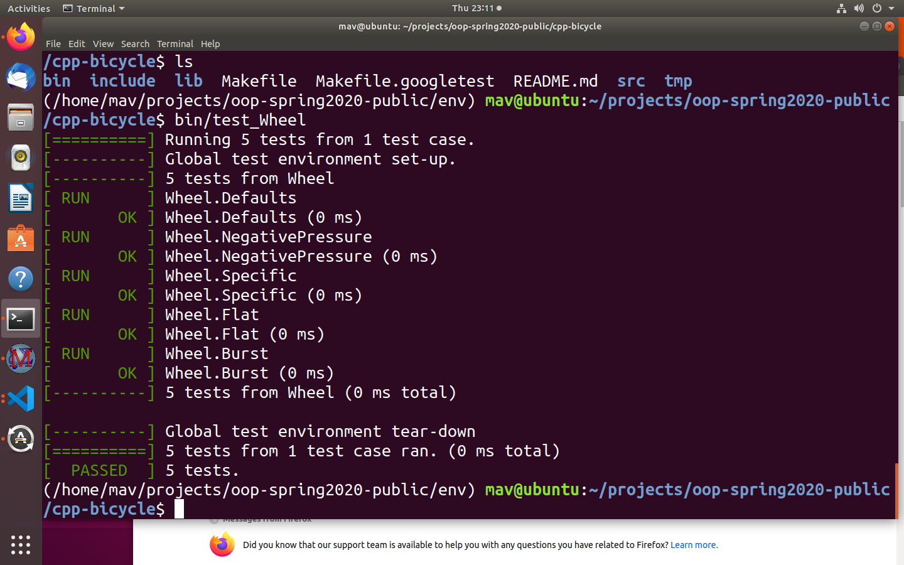
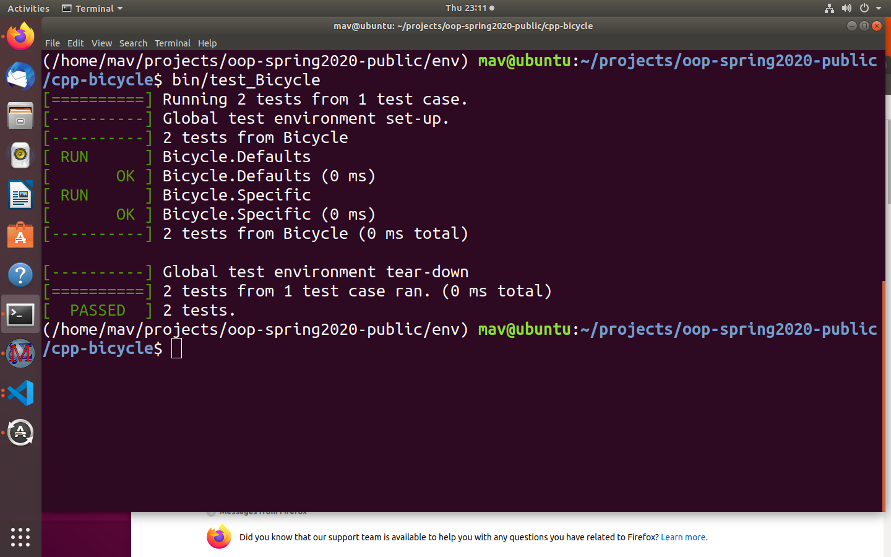

# Bicycle

Adapted from `cpp-greet` in https://github.com/wmacevoy/csci000-astudent
and python example, with a fairly literal translation of the python notation
to c++ and the google test framework.

## Build

```bash
make clean
make all
```

## Test

```bash
bin/test_Wheel
bin/test_Bicycle
```

## Clean-Build-Test Screen Capture





